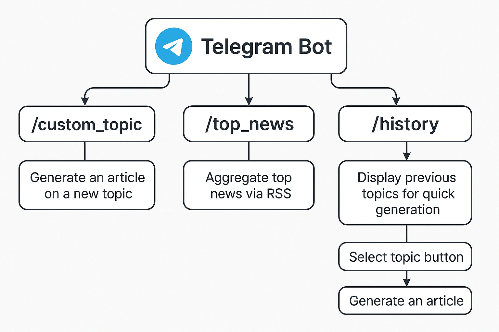

# AI Content Assistant

Welcome to the **AI Content Assistant** project! 🚀

This bot helps you automatically generate article drafts from recent news, aggregate information on a custom topic, rewrite it in your style, and prepare it for publishing.

---

## Features

- 📈 **Top News**: Get a summarized article based on trending topics.
- 📅 **Custom Topic**: Request an article draft for your custom topic.
- 📄 **History**: See your previously generated articles.
- 🗓️ **Scheduling (Coming Soon)**: Schedule automatic generation of articles daily or weekly.

---

## Architecture

```plaintext
Telegram Bot
    └── Commands
        └── /top_news, /custom_topic, /history, etc.
            └── Handlers
                └── Logic for handling user inputs and generating articles
    └── Agents
        ├── Topic Aggregator (search_articles_by_topic)
        ├── RSS Aggregator (fetch_rss_articles)
        ├── Summarizer (summarize_articles)
        └── Rewriter (rewrite_text)
    └── DB
        └── CRUD operations (save history, get history)
```

---

## Basic Flow



(You should save the corresponding image `architecture_flow.png` inside a `docs/` folder.)

---

## Setup

```bash
git clone https://github.com/your-repo/ai-content-assistant.git
cd ai-content-assistant
python3 -m venv .venv
source .venv/bin/activate
pip install -r requirements.txt
```

Create `.env` file:

```dotenv
TELEGRAM_TOKEN=your-telegram-bot-token
DATABASE_URL=your-database-url
```

---

## Running Locally

```bash
python run_bot.py
```

Bot will be running and listening for Telegram commands!

---

## Testing

```bash
pytest
```

---

## Next steps
- [ ] Add Scheduled Articles (morning generation)
- [ ] Allow direct feedback to refine generated articles
- [ ] Add image/diagram generation based on article content

---

Made with ❤️ to boost your content creation journey!